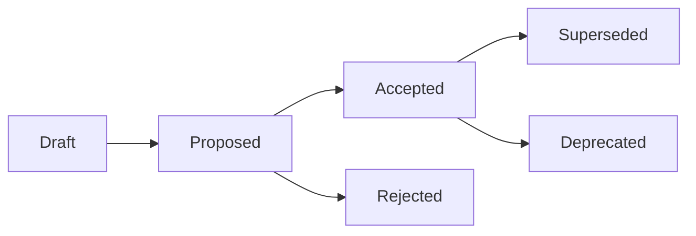

# Architecture Decision Records

## Purpose
Define how Architecture Decision Records are created, reviewed, approved, superseded, and maintained in Risenologi JAMS.

## Scope
Applies to durable technical decisions that affect architecture, data, security, deployment, observability, testing, integration boundaries, operational behavior, or long-term maintainability.

## Status
Active governance guide.

## Owner
TBD.

## Last Updated
2026-07-26

## Table of Contents
- [1. What ADRs Are](#1-what-adrs-are)
- [2. When an ADR Is Required](#2-when-an-adr-is-required)
- [3. When an ADR Is Not Required](#3-when-an-adr-is-not-required)
- [4. ADR Lifecycle](#4-adr-lifecycle)
- [5. Naming and Numbering](#5-naming-and-numbering)
- [6. Review Requirements](#6-review-requirements)
- [7. Relationship to RFCs](#7-relationship-to-rfcs)
- [8. Maintenance Rules](#8-maintenance-rules)
- [9. Revision History](#9-revision-history)
- [10. TODO](#10-todo)

## 1. What ADRs Are
Architecture Decision Records capture decisions that future contributors must understand and respect.

An ADR SHALL explain the context, decision, consequences, alternatives, and operational impact of a durable technical choice. ADRs SHOULD be concise enough to review but complete enough to guide future work.

## 2. When an ADR Is Required
An ADR SHALL be created before changes that introduce or materially alter:

| Decision Area | ADR Requirement |
| --- | --- |
| System architecture | Required for changes to major boundaries, layers, modules, or integration patterns. |
| Data architecture | Required for durable data modeling, tenancy, auditability, retention, or security decisions. |
| Security architecture | Required for authentication, authorization, secrets, RLS, audit logging, or incident response changes. |
| Deployment architecture | Required for environment, release, rollback, backup, or disaster recovery strategy changes. |
| Operational architecture | Required for observability, logging, caching, performance, reliability, or support decisions. |
| Technology choices | Required when adopting, replacing, or removing foundational technologies or external services. |

## 3. When an ADR Is Not Required
An ADR MAY be unnecessary for small documentation edits, typo fixes, refactors that do not change architectural intent, or implementation details already covered by an accepted ADR.

When uncertain, contributors SHOULD create an RFC first or ask maintainers whether an ADR is required.

## 4. ADR Lifecycle

| Status | Meaning |
| --- | --- |
| Draft | The decision is being prepared and is not ready for formal review. |
| Proposed | The decision is ready for review but is not yet authoritative. |
| Accepted | The decision is approved and SHALL guide future work. |
| Rejected | The decision was reviewed and not approved. |
| Superseded | A newer ADR replaces the decision. |
| Deprecated | The decision remains historical record but SHOULD NOT guide new work. |

## 5. Naming and Numbering
ADR files SHALL use the format `ADR-NNNN-short-title.md`.

The template is `ADR-0001-template.md`. New ADRs SHALL copy the template and use the next available sequence number.

## 6. Review Requirements
Every proposed ADR SHALL have an owner, reviewers, and evidence of approval before it becomes accepted.

Reviewers SHOULD verify that the ADR:
- Aligns with the Engineering Constitution.
- References relevant product, security, deployment, database, API, or architecture documents.
- Describes consequences and alternatives.
- Identifies operational and security impact.
- Avoids defining unapproved product behavior.

## 7. Relationship to RFCs
RFCs are proposals for discussion. ADRs are records of accepted durable decisions.

An RFC SHOULD precede an ADR when a decision needs stakeholder alignment, alternatives analysis, staged rollout planning, or significant cross-functional review.

An accepted RFC MAY result in one or more ADRs.

## 8. Maintenance Rules
ADRs are immutable historical records after acceptance, except for corrections that do not change meaning.

A decision SHALL be changed by creating a new ADR that supersedes the previous ADR. The superseded ADR SHALL be updated only to identify the superseding ADR.

## 9. Revision History
| Date | Author | Change |
| --- | --- | --- |
| 2026-07-26 | AI Engineering Agent | Created ADR governance guide. |

## 10. TODO
- Assign permanent ADR ownership and approval roles.
- Define reviewer groups after the team structure is finalized.
