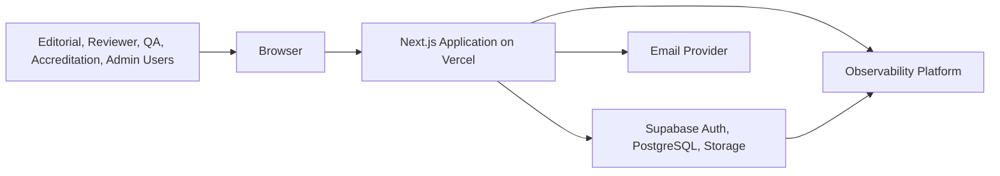

# System Context Diagram

## Purpose
Reserve architecture diagram source for the future Risenologi JAMS system context.

## Scope
Covers users, Next.js, Supabase, Vercel, email provider, observability provider, and future external integrations at a conceptual level.

## Status
Placeholder.

## Owner
TBD.

## Last Updated
2026-07-26

## Table of Contents
- [Mermaid Draft](#mermaid-draft)
- [TODO](#todo)

## Mermaid Draft

## TODO
- Update this diagram after ADRs approve exact runtime and integration boundaries.
