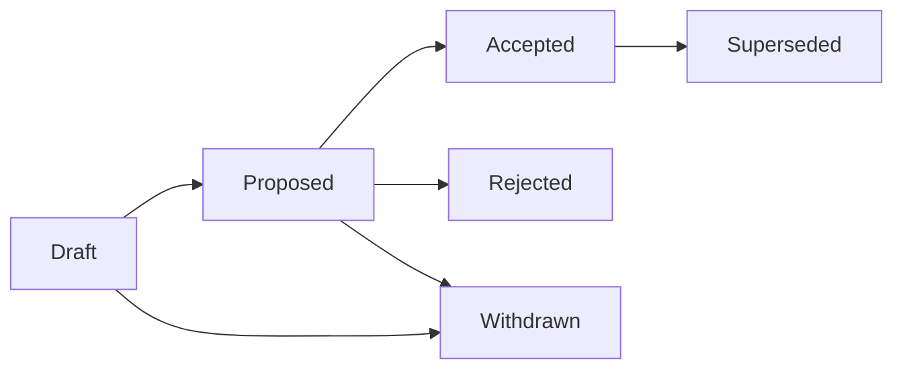

# Requests for Comments

## Purpose
Define how Requests for Comments are created, reviewed, approved, rejected, and maintained in Risenologi JAMS.

## Scope
Applies to significant product, architecture, security, operational, governance, process, or quality proposals that need review before implementation.

## Status
Active governance guide.

## Owner
TBD.

## Last Updated
2026-07-26

## Table of Contents
- [1. What RFCs Are](#1-what-rfcs-are)
- [2. When an RFC Is Required](#2-when-an-rfc-is-required)
- [3. When an RFC Is Not Required](#3-when-an-rfc-is-not-required)
- [4. RFC Lifecycle](#4-rfc-lifecycle)
- [5. Naming and Numbering](#5-naming-and-numbering)
- [6. Review Requirements](#6-review-requirements)
- [7. Relationship to ADRs](#7-relationship-to-adrs)
- [8. Maintenance Rules](#8-maintenance-rules)
- [9. Revision History](#9-revision-history)
- [10. TODO](#10-todo)

## 1. What RFCs Are
Requests for Comments are structured proposals for decisions that need discussion before implementation.

An RFC SHALL describe the problem, goals, non-goals, proposal, alternatives, risks, rollout plan, and acceptance criteria. RFCs SHOULD make assumptions explicit and invite review before irreversible work begins.

## 2. When an RFC Is Required
An RFC SHALL be created before work that materially changes:

| Proposal Area | RFC Requirement |
| --- | --- |
| Product scope | Required for new workflows, user-facing behavior, roles, permissions, or success metrics. |
| Architecture | Required for major design changes before one or more ADRs are accepted. |
| Data and security | Required for proposals affecting sensitive data, auditability, authorization, retention, or compliance. |
| Operations | Required for deployment, monitoring, incident response, backup, or support process changes. |
| Governance | Required for changes to decision-making, review policy, documentation rules, or quality gates. |
| Delivery planning | Required for large initiatives, phased rollout plans, or cross-functional dependency management. |

## 3. When an RFC Is Not Required
An RFC MAY be unnecessary for typo fixes, small documentation improvements, implementation tasks already approved by an RFC or ADR, or routine maintenance that does not change product or architectural intent.

When scope is unclear, contributors SHOULD start with a lightweight RFC instead of proceeding directly to implementation.

## 4. RFC Lifecycle

| Status | Meaning |
| --- | --- |
| Draft | The proposal is being prepared and is not ready for review. |
| Proposed | The proposal is ready for stakeholder review. |
| Accepted | The proposal is approved and MAY proceed to implementation planning. |
| Rejected | The proposal was reviewed and not approved. |
| Withdrawn | The owner removed the proposal from consideration. |
| Superseded | A newer RFC replaces the proposal. |

## 5. Naming and Numbering
RFC files SHALL use the format `RFC-NNNN-short-title.md`.

The template is `RFC-0001-template.md`. New RFCs SHALL copy the template and use the next available sequence number.

## 6. Review Requirements
Every proposed RFC SHALL have an owner, reviewers, and a documented decision outcome.

Reviewers SHOULD verify that the RFC:
- Aligns with the Engineering Constitution and Product Vision.
- States goals, non-goals, risks, assumptions, and acceptance criteria.
- Identifies user, stakeholder, security, privacy, and operational impact.
- Avoids implementation details until the proposal is approved.
- Identifies follow-up ADRs, documentation updates, or delivery tasks when needed.

## 7. Relationship to ADRs
RFCs support discussion and alignment before durable decisions are recorded.

An accepted RFC MAY produce one or more ADRs. ADRs SHALL record final architectural decisions that future contributors must follow.

## 8. Maintenance Rules
RFCs remain historical records after review.

Accepted RFCs SHOULD be updated only for status, decision outcome, links, and minor corrections. Material changes SHALL be proposed in a new RFC.

## 9. Revision History
| Date | Author | Change |
| --- | --- | --- |
| 2026-07-26 | AI Engineering Agent | Created RFC governance guide. |

## 10. TODO
- Assign permanent RFC ownership and approval roles.
- Define stakeholder reviewer groups after the team structure is finalized.
